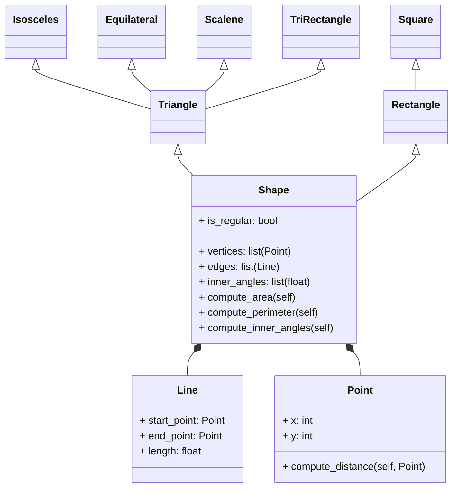

# Reto_04-POO

# 1. Ejercicio de Clase (Figuras)



```python
import math

class Point:
    def __init__(self, x:int, y:int):
        self._x = x
        self._y = y
        
    def get_x(self):
        return self._x
    
    def get_y(self):
        return self._y
    
    def compute_distance(self, other_point):
        return ((self._x - other_point.get_x())**2 + (self._y - other_point.get_y())**2)**0.5

class Line:
    def __init__(self, point1:Point, point2:Point):
        self._length = point1.compute_distance(point2)
        self._start = point1
        self._end = point2
    
    def get_start(self):
        return self._start
    
    def get_end(self):
        return self._end
    
    def get_length(self):
        return self._length    
```
En primer lugar, merece la pena aclarar que se importó la libreria math para poder utilizar algunas funciones trigonométricas y facilitar el cálculo futuro de los ángulos internos de cada polígono (no encontré más formas de calcular ángulos internos sin complicarme más allá que el con el teorema del coseno). Se definieron las dos clases, Point y Line,  claves para definir a las diferentes figuras. A la clase Point se le definió un método para calcular la distancia entre dos puntos. Por su parte, el la clase Line se definió el atributo length con la ayuda del método que se creó para la clase anterior. Cada línea instanciada en Line debe recibir dos puntos.
```python
class Shape:
    def __init__(self, vertices):
        self._vertices = vertices
        self._edges = [Line(vertices[i], vertices[(i+1)%len(vertices)]) for i in range(len(vertices))] #Cierra la figura con el primer punto (resto de la división de i entre el número de vértices)
        self._inner_angles = self.inner_angles()
        self._is_regular = self.is_regular()
        
    def inner_angles(self):
        self._inner_angles = []
        for i in range(len(self._vertices)):
            prev_point = self._vertices[i-1]
            current_point = self._vertices[i]
            next_point = self._vertices[(i+1)%len(self._vertices)]
            a = prev_point.compute_distance(current_point)
            b = current_point.compute_distance(next_point)
            c = next_point.compute_distance(prev_point)
            angle_radians = math.acos((a**2 + b**2 - c**2)/(2*a*b))
            angle_degrees = round(math.degrees(angle_radians))
            self._inner_angles.append(angle_degrees)
        return self._inner_angles
                
    def is_regular(self):
        first_angle = self._inner_angles[0]
        for angle in self._inner_angles:
            if angle != first_angle:
                return False
        return True        
    
    def get_edges(self):
        return self._edges
    
    def get_vertices(self):
        return self._vertices
    
    def get_inner_angles(self):
        return self._inner_angles
    
    def compute_area(self):
        pass
    
    def compute_perimeter(self):
        pass
    
    def compute_inner_angles(self):
        pass

```
En este momento, se creó la superclase Shape con los atributos de vertices, edges, innerangles y is_regular. Los vertices serán creados al momento de instanciar las figuras, mientras que las aristas de la figura se apoyarán en los mismos vertices para su creación. Para esto, se definieron como una lista de instancias de la clase Línea, donde el primer punto correspondería al primer vértice instanciado, y el segundo con el segundo vértice. Para poder recorrer la lista, se usó un for que la recorre por sus índices, y define cuál vértice usar. El orden que se le buscó dar a este recorrido fue el de tomar los vértices consecutivos, hasta que llegase un punto donde la figura tuviese que ser cerrada y volver al vértice inicial. Para esto se usó ```vertices[(i+1)%len(vertices)]```, que garantiza precisamente que se cierre la figura tras el recorrido. En segundo lugar, se definió un método para poder calcular los ángulos internos del polígono. Para esto se definieron 3 puntos como previo, actual y siguiente (dentro de la lista de vértices dada) para calcular la distancia entre ellos y obtener 3 segmentos para poder hacer uso de la ley del coseno. Los ángulos dados por la función ```acos``` son dados en radianes, por lo que se realizó la conversión a grados y se redonderon al entero más cercano. Finalmente se creó un método para verificar si un polígono es regular o no, usando el criterio de que para que un polígono sea regular sus lados y ángulos internos deben ser iguales. Se definierons métodos para áreas, perímetros y ángulos internos, que más adelante serán modificados en las subclases aplicando polimorfismo.
```python
    
class Rectangle(Shape):
    def __init__(self, vertices):
        super().__init__(vertices)
        
    def compute_area(self):
        print(self._edges[0].get_length())
        return self._edges[0].get_length() * self._edges[1].get_length()
    
    def compute_perimeter(self):
        return 2*self._edges[0].get_length() + 2*self._edges[1].get_length()
    
    def compute_inner_angles(self):
        return self._inner_angles
        
class Square(Rectangle):
    def __init__(self, vertices):
        super().__init__(vertices)
    
    def compute_area(self):
        return self._edges[0].get_length()**2
    
    def compute_perimeter(self):
        return 4*self._edges[0].get_length()
    
    def compute_inner_angles(self):
        return self._inner_angles
```
En este punto se creó una clase Rectángulo que hereda de Shape, y una clase Square que hereda de Rectángulo. Para el rectángulo se definió un método específico de perímetro y área, que posteriormente se redefinió para el cuadrado teniendo en cuenta que para este último todos sus lados son iguales.
```python
   
class Triangle(Shape):
    def __init__(self, vertices):
        super().__init__(vertices)
        
    def compute_area(self):
        s = self.compute_perimeter()/2
        a = self._edges[0].get_length()
        b = self._edges[1].get_length()
        c = self._edges[2].get_length()
        return (s*(s-a)*(s-b)*(s-c))**0.5
    
    def compute_perimeter(self):
        pass
```
La clase Triangle hereda de shape, y para esta se definió un método general para el cálculo de áreas que dependan de la altura netamente y sea complicado determinarla solo conociendo los vértices del mismo y por ende los lados. El método aplicado fue usando la fórmula de Herón, que se basa en el semiperímetro de un triángulo (suma de lados/2) y en los propios lados de la figura. Merece la pena aclarar que este método se puede aplicar a cualquier triángulo que se desee. Para el isóceles y escaleno viene de maravilla, para el rectángulo se usó para no depender de la orientación del mismo, mientras que para el triángulo equilatero se usó una fórmula producto de una deducción matemática de la altura de cualquier triángulo con lados y ángulos iguales. 
```python

class EquilateralTriangle(Triangle):
    def __init__(self, vertices):
        super().__init__(vertices)
    
    def compute_area(self):
        return (3**0.5/4) * self._edges[0].get_length()**2 #Deducción a partir de partir el triángulo en dos triángulos rectángulos de 30° y 60°
    
    def compute_perimeter(self):
        return 3*self._edges[0].get_length()
    
    def compute_inner_angles(self):
        return self._inner_angles
    
class IsoscelesTriangle(Triangle):
    def __init__(self, vertices):
        super().__init__(vertices)
        
    def compute_perimeter(self):
        return self._edges[0].get_length() + self._edges[1].get_length() + self._edges[2].get_length()
    
    def compute_area(self):
        return Triangle.compute_area(self)
    
    def compute_inner_angles(self):
        return self._inner_angles


class ScaleneTriangle(Triangle):
    def __init__(self, vertices):
        super().__init__(vertices)
        
    def compute_perimeter(self):
        return self._edges[0].get_length() + self._edges[1].get_length() + self._edges[2].get_length()
    
    def compute_area(self):
        return Triangle.compute_area(self)
    
    def compute_inner_angles(self):
        return self._inner_angles

class RectangleTriangle(Triangle):
    def __init__(self, vertices):
        super().__init__(vertices)
        
    def compute_perimeter(self):
        return self._edges[0].get_length() + self._edges[1].get_length() + self._edges[2].get_length()
    
    def compute_area(self):
        return Triangle.compute_area(self)
    
    def compute_inner_angles(self):
        return self._inner_angles

```
Finalmente se realizó un test para probar el funcionamiento del código. Para el test se instanciaron diferentes figuras, y se le pidió al programa entregar los valores de área, perímetro y ángulos internos. Merece la pena resaltar que estos datos fueron contrastados con los obtenidos de las mismas figuras creadas en Geogebra. Cada figura fue instanciada en su respectiva clase, dándole como atributos 4 puntos en el caso de los rectángulos, y 3 en el de los triángulos. 

```python

### Test

## Square

square = Square ([Point(0,0), Point(0,1), Point(1,1), Point(1,0)])
print("Cuadrado")
print(f"El área del cuadrado es {square.compute_area()}")
print(f"El perímetro del cuadrado es {square.compute_perimeter()}")
print(f"Los ángulos internos son {square.compute_inner_angles()}""\n")

## Rectangle
print("Rectángulo")
rectangle = Rectangle ([Point(0,0), Point(0,4), Point(2,4), Point(2,0)])
print(f"El área del rectángulo es {rectangle.compute_area()}")
print(f"El perímetro del rectángulo es {rectangle.compute_perimeter()}")
print(f"Los ángulos internos son {rectangle.compute_inner_angles()}""\n")

## Equilateral Triangle
print("Triángulo Equilátero")
eq_triangle = EquilateralTriangle ([Point(2,0), Point(4,0), Point(3, 2)])
print(f"El área del triángulo equilátero es {eq_triangle.compute_area()}")
print(f"El perímetro del triángulo equilátero es {eq_triangle.compute_perimeter()}")
print(f"Los ángulos internos son {eq_triangle.compute_inner_angles()}" "\n")


## Isosceles Triangle
iso_triangle = IsoscelesTriangle ([Point(3,1), Point(9,1), Point(6,4)])
print("Triángulo Isósceles")
print(f"El área del triángulo isósceles es {iso_triangle.compute_area()}")
print(f"El perímetro del triángulo isósceles es {iso_triangle.compute_perimeter()}")
print(f"Los ángulos internos son {iso_triangle.compute_inner_angles()}" "\n")

## Scalene Triangle
sca_triangle = ScaleneTriangle ([Point(3,5), Point(11,6), Point(8,8)])
print("Triángulo Escaleno")
print(f"El área del triángulo escaleno es {sca_triangle.compute_area()}")
print(f"El perímetro del triángulo escaleno es {sca_triangle.compute_perimeter()}")
print(f"Los ángulos internos son {sca_triangle.compute_inner_angles()}" "\n")

## Rectangle Triangle
rect_triangle = RectangleTriangle ([Point(6,3), Point(12,3), Point(6,8)])
print("Triángulo Rectángulo")
print(f"El área del triángulo rectángulo es {rect_triangle.compute_area()}")
print(f"El perímetro del triángulo rectángulo es {rect_triangle.compute_perimeter()}")
print(f"Los ángulos internos son {rect_triangle.compute_inner_angles()}")

```


# 2.Escenario Restaurante 2.0
```python

class Order():
    def __init__(self) -> None:
        self._items = []
        self._total = None
        
    def get_items(self):
        return self._items
    
    def calculate_price(self):
        self._total = sum([item.price * item.quantity for item in self._items])
    
    def get_total(self):
        if self._total == None:
            self.calculate_price()
        return self._total
        
    def add_item(self, item):
        self._items.append(item)
        
    def includes_main_course(self):
        for item in self._items:
            if isinstance(item, MainCourse):
                return True
        
    def includes_beverage(self):
        for item in self._items:
            if isinstance(item, Beverage):
                return True
   
    def print_bill(self):
        print("Su cuenta es: ")
        for item in self._items:
            print(f"{item.name} - {item.price} - {item.quantity}")
        discount = 0
        items_for_discount = " no llevar ningun producto que aplique para descuento"
        if self.includes_main_course() and self.get_total() > 25000 and self.get_total()  < 50000:
            discount= 0.1* self.get_total()
            items_for_discount = "llevar algún plato principal y más de 25000 pesos en compras"
            
        elif self. includes_main_course and self.includes_beverage():
            items_for_discount = "llevar algún plato principal y alguna bebida"
            discount = 0.05 * self.get_total()
            
        elif self.get_total() > 50000:
            items_for_discount = "llevar más de 50000 pesos en compras"
            discount = 0.2 * self.get_total()
        
        self._total -= discount
        print(f"Total a pagar: {self._total}, con un descuento aplicado de {discount} pesos por {items_for_discount}")

```
En primer lugar, se modificó la clase Order, donde además de añadir atributos privados, setters y getters, se definieron dos nuevos métodos, uno para verificar si una orden contenía platos principales, y otro para verificar si tenía bebidas. Posteriormente se modificó el método para calcular la cuenta de la orden, incluyendo precios, cantidad y descuentos. Merece la pena restaltar que los descuentos se organizaron de la siguiente manera:

* Descuento del 10% en caso de llevar alguna orden con plato principal y con un precio entre 25000 y 50000 pesos
* Descuento del 5% en caso de llevar un plato principal y una bebida
* Descuento del 20% en caso de llevar más de 50000 pesos en compras


```python

class MenuItem():
    def __init__(self, price, name, quantity) -> None:
        self.price = price
        self.name = name
        self.quantity = quantity
        
    

class Beverage(MenuItem):
    def __init__(self, price, size, name, quantity) -> None:
        super().__init__(price, name, quantity)
        self._size = size
        
    def get_size(self):
        return self._size
    
    def set_size(self, size):
        self._size = size

class Appetizer(MenuItem):
    def __init__(self, price, customers, name, quantity) -> None:
        super().__init__(price, name, quantity)
        self._customers = customers
        
    def get_customers(self):
        return self._customers
    
    def set_customers(self, customers):
        self._customers = customers

class MainCourse(MenuItem):
    def __init__(self, price, grammage, name, quantity) -> None:
        super().__init__(price, name, quantity)
        self._grammage = grammage
        
    def get_grammage(self):
        return self._grammage
    
    def set_grammage(self, grammage):
        self._grammage = grammage
    
class PaymentMeans():
    def __init__(self):
        pass
    
    def pay(self, amount):
        pass
    
class Card(PaymentMeans):
    def __init__(self, number, cvv):
        super().__init__()
        self._number = number
        self._cvv = cvv
    
    def pay(self, amount):
        print(f"Se han pagado {amount} pesos con la tarjeta {self._number}")
        
class Cash(PaymentMeans):
    def __init__(self, amount_payed):
        super().__init__()
        self._amount_payed = amount_payed
    
    def pay(self, amount):
        if self._amount_payed >= amount:
            print(f"Pago realizado en efectivo, cambio: {self._amount_payed - amount} pesos")
        
        else:
            print(f"El monto pagado no es suficiente, faltan {amount - self._amount_payed} pesos")
```
En este punto, se crearon 3 nuevas clases referentes a los métodos de pago de la orden (1 siendo la clase padre y las otras 2 las hijas). La primera subclase se usó para describir el pago por tarjeta, donde se indicaron como atributos de instancia el número y el código cvv de la tarjeta; además de un método para pagar con tarjeta. La segunda subclase se usó para describir el pago por efectivo, solicitando un monto de dinero como atributo de instancia, y realizando los respectivos cálculos para verificar si el usuario pagó adecuadamente (y devolver cambio en caso de ser necesario) o si entregó menos dinero del costo de la orden. 
```python 
order = Order()

selection = input("¿Desea ordenar un plato principal? (s/n): ")
if selection == "s":
    print("""Platos principales:
    1. Hamburguesa sencilla
    2. Hamburguesa doble
    3. Hamburguesa ranchera
    4. Hamburguesa vegetariana
    """)
    main_course = int(input("Seleccione una opción: "))
    if main_course == 1:
        print("Hamburguesa sencilla seleccionada")
        order.add_item(MainCourse(12000, 150, "Hamburguesa sencilla", int(input("Cantidad: "))))
    elif main_course == 2:
        print("Hamburguesa doble seleccionado")
        order.add_item(MainCourse(16000, 300, "Hamburguesa doble", int(input("Cantidad: "))))
    elif main_course == 3:
        print("Hamburguesa ranchera seleccionada")
        order.add_item(MainCourse(20000, 200, "Hamburguesa ranchera", int(input("Cantidad: "))))
    elif main_course == 4:
        print("Hamburguesa vegetariana seleccionada")
        order.add_item(MainCourse(18000, 200, "Hamburguesa vegetariana", int(input("Cantidad: "))))


selection = input("¿Desea ordenar una entrada? (s/n): ")
if selection == "s":
    print("""Entradas:
    1. Canasta de pan (3 personas)
    2. Sopa (1 persona)
    3. Papas fritas (5 personas)
    """)
    appetizer = int(input("Seleccione una opción: "))
    if appetizer == 1:
        print("Canasta de pan seleccionada")
        order.add_item(Appetizer(4000, 3, "Canasta de pan", int(input("Cantidad: "))))
    elif appetizer == 2:
        print("Sopa seleccionada")
        order.add_item(Appetizer(6000, 1, "Sopa", int(input("Cantidad: "))))
    elif appetizer == 3:
        print("Papas fritas seleccionadas")
        order.add_item(Appetizer(8000, 5, "Papas fritas", int(input("Cantidad: "))))


selection = input("¿Desea ordenar una bebida? (s/n): ")
if selection == "s":
    print("""Bebidas:
    1. Agua
    2. Refresco
    3. Jugo
    """)
    beverage = int(input("Seleccione una opción: "))
    if beverage == 1:
        print("Agua seleccionada")
        order.add_item(Beverage(2000, 500, "Agua", int(input("Cantidad: "))))
    elif beverage == 2:
        print("Refresco seleccionado")
        order.add_item(Beverage(3000, 500, "Refresco", int(input("Cantidad: "))))
    elif beverage == 3:
        print("Jugo seleccionado")
        order.add_item(Beverage(5000, 600, "Jugo", int(input("Cantidad: "))))

order.calculate_price()


order.print_bill()

card_number = "123581321"
cvv = "161"

while True:
    selection = input("¿Desea pagar con tarjeta? (s/n): ")
    if selection == "s":
        card = Card(card_number, cvv)
        card.pay(order.get_total())
        break
    elif selection == "n":
        cash = Cash(int(input("Ingrese el monto a pagar: ")))
        cash.pay(order.get_total())
        break
    else:
        print("Opción no válida")
    
    


```
Finalmente se utilizó la misma interfaz del escenario creado en el reto 3, y se le agregó una forma de solicitarle al cliente la forma de pago, y realizar la cancelación del costo de la orden. Se utilizó una tarjeta ya instanciada para usar el método de la clase Card. 
